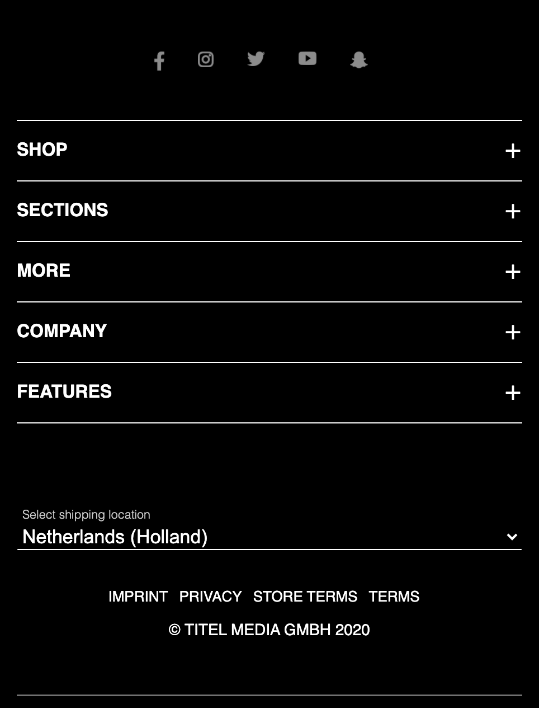
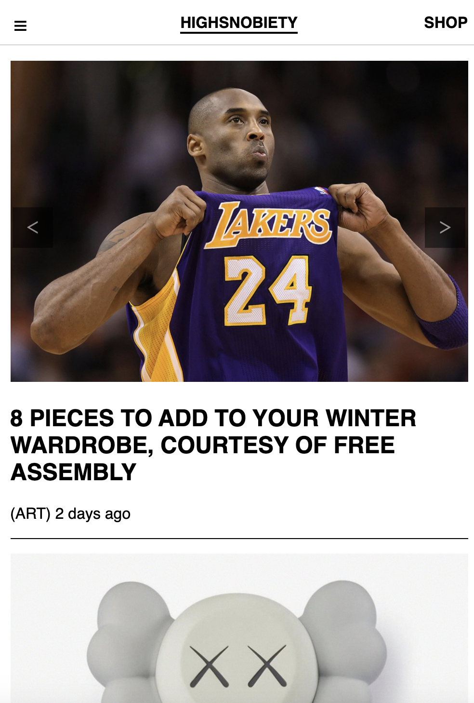
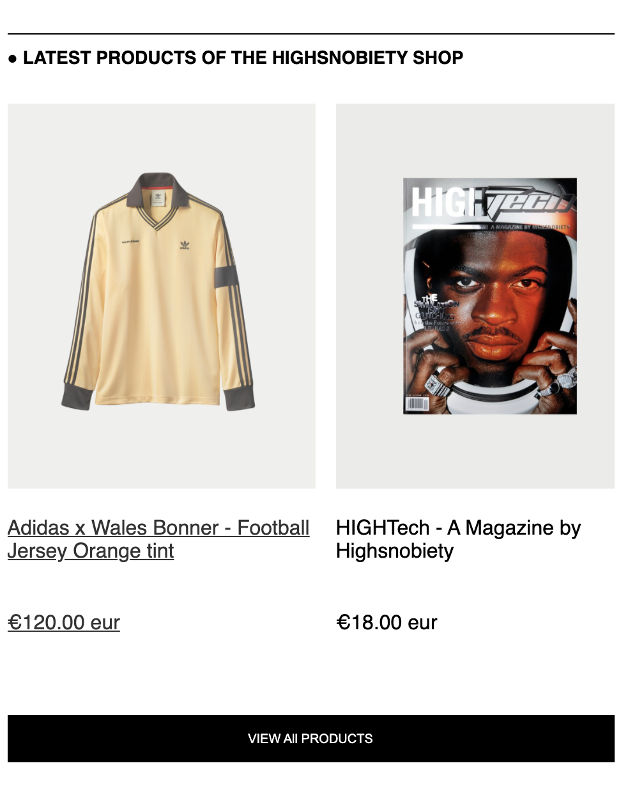
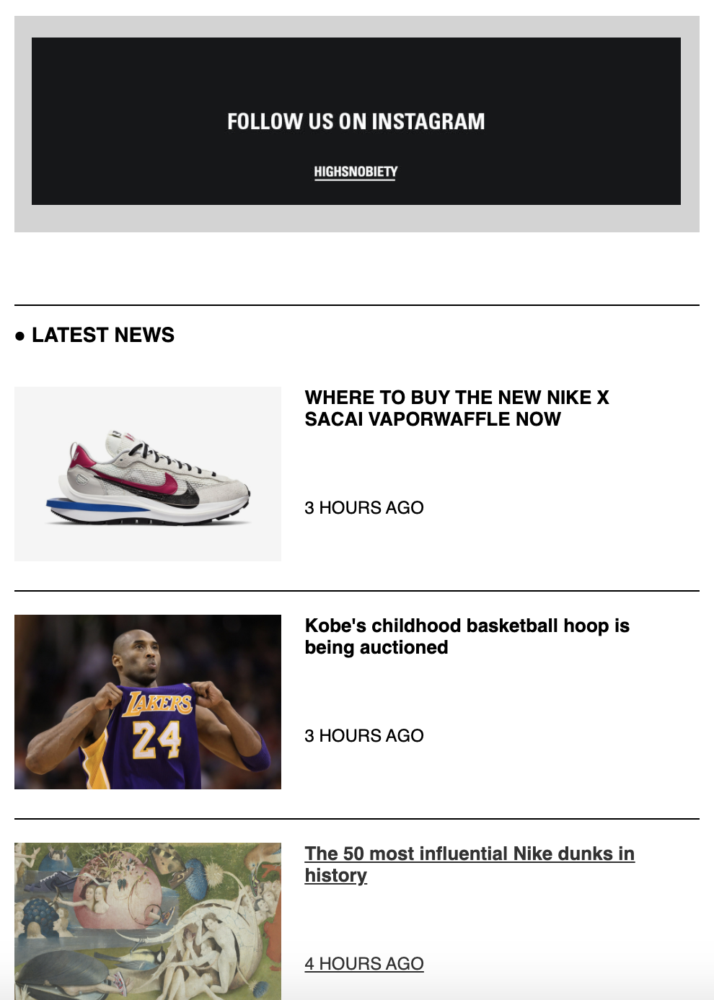
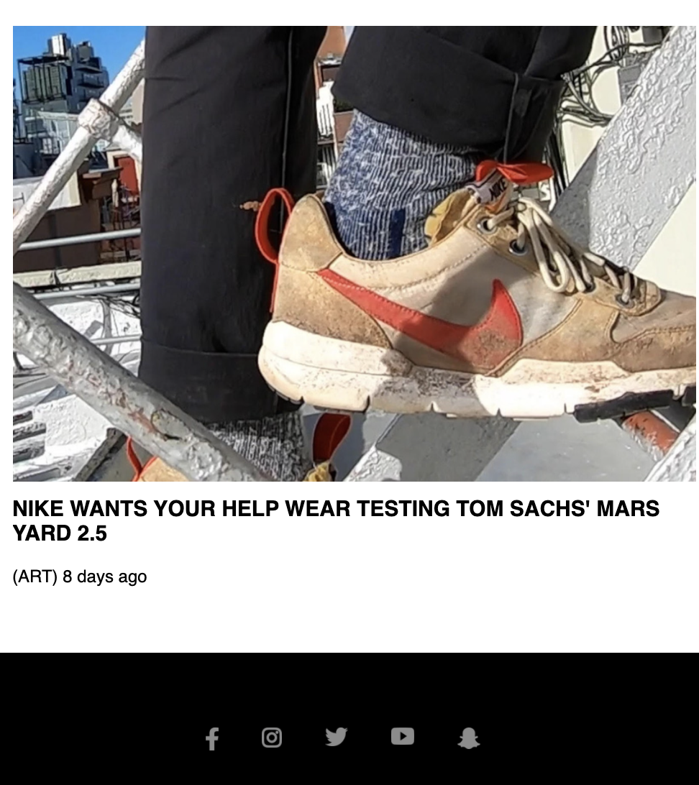
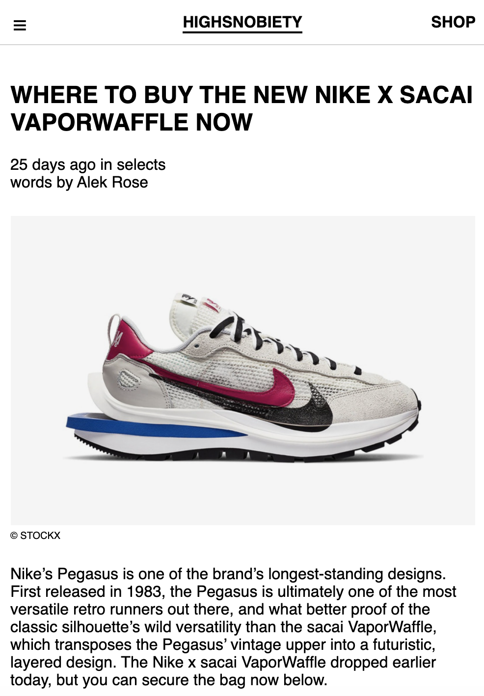
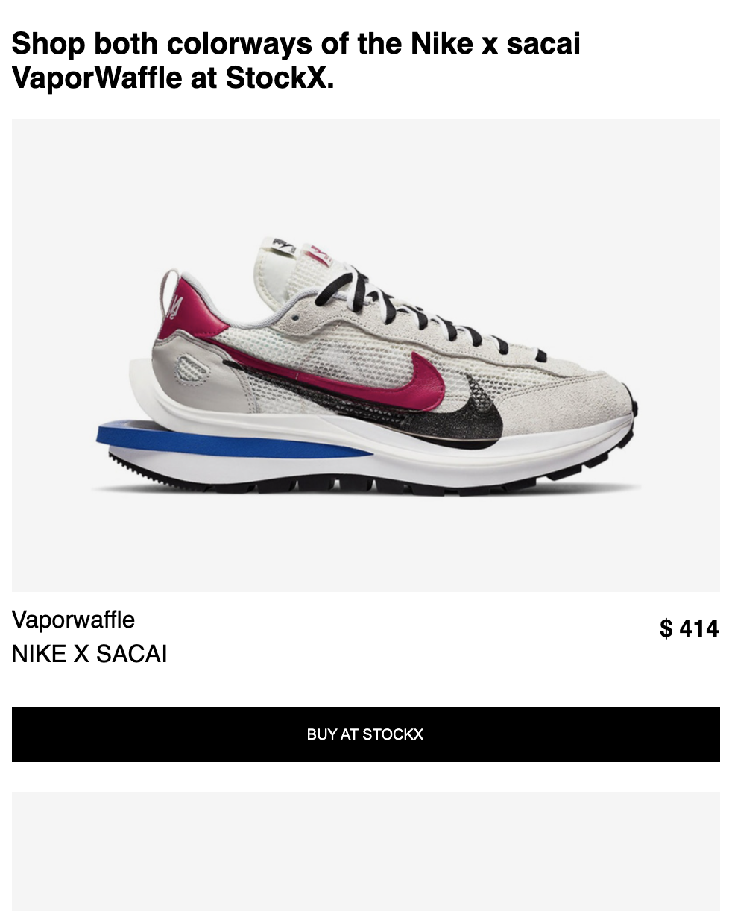
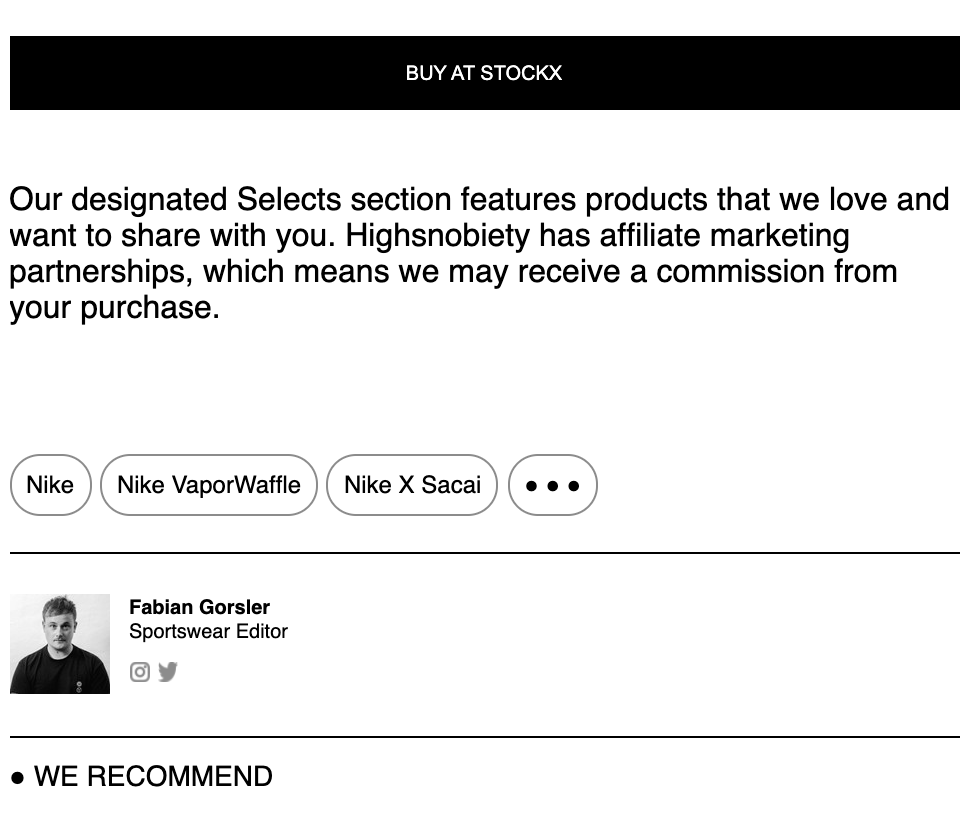
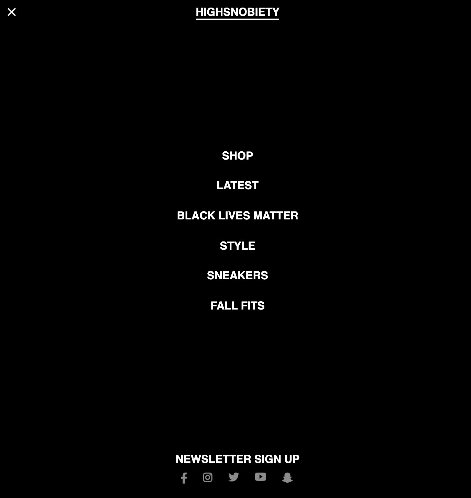
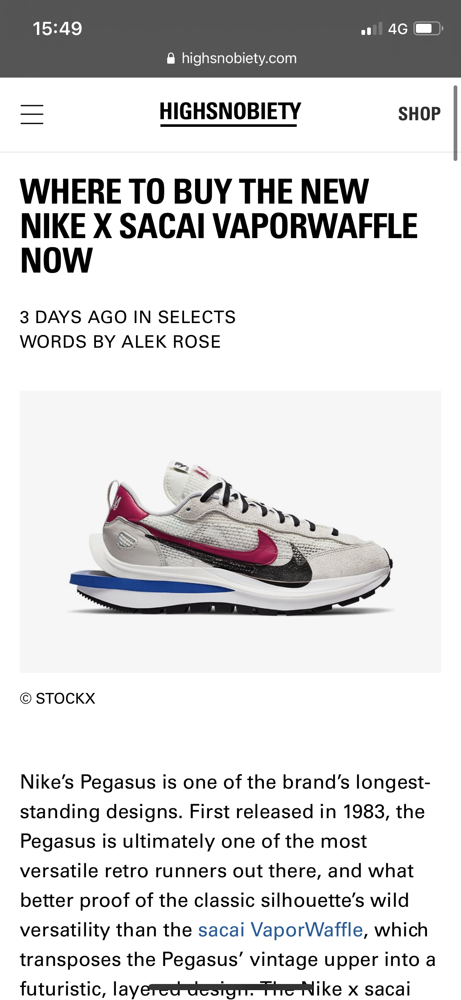

# Procesverslag
**Auteur:** -Sam Boot-

Markdown cheat cheet: [Hulp bij het schrijven van Markdown](https://github.com/adam-p/markdown-here/wiki/Markdown-Cheatsheet). Nb. de standaardstructuur en de spartaanse opmaak zijn helemaal prima. Het gaat om de inhoud van je procesverslag. Besteedt de tijd voor pracht en praal aan je website.

## Bronnenlijst
1. https://css-tricks.com/snippets/css/a-guide-to-flexbox/
2. https://dlo.mijnhva.nl/d2l/le/content/192710/Home
3. https://css-tricks.com/pure-css-horizontal-scrolling/
4. https://dev.to/ljcdev/easy-hamburger-menu-with-js-2do0

## Eindgesprek (week 7/8)

-dit ging goed & dit was lastig-

In de kerstvakantie heb ik veel gewerkt aan mijn opdracht. Het is me helaas niet gelukt wat ik voor ogen had, maar het is me wel gelukt om de website voor het grootste gedeelte responsive te maken. Ik vond het heel moeilijk om het overzicht te bewaren. Het gebeurd heel vaak dat als ik iets aanpas, iets anders dan verspringt/ stuk gaat. Dat vond ik heel frustrerend. Als zoiets gebeurd demotiveerd het je ook heel erg. Het was lastig om de motivatie vast te houden. Ik vond het ook moeilijk om geen gebruik te maken van classes en id's. Dit was ik niet gewent, dus het ging heel vaak fout. Het is me helaas niet gelukt om alles met typeselectoreren aan te spreken. De drempel om vragen te stellen lag voor mij ook hoger door de online lessen die worden gegeven.

**Screenshot(s):**

-screenshot(s) van je eindresultaat-

## Voortgang 3 (week 6)

-same as voortgang 1-

Het gaat op het moment heel erg moeizaam. tijdens de les kreeg ik te horen dat je zo min mogelijk classes moet gebruiken. Ik was hier niet van op de hoogte en moest daarom een groot gedeelte van mijn code aanpassen. Het aanpassen gaat heel erg moeizaam, omdat alles telkens verspringt. Hierdoor loop ik ook erg achter en weet ik niet of ik het ga redden.
Heel erg frustrerend!

## Voortgang 2 (week 5)

-same as voortgang 1-

De afgelopen twee weken gingen moeizamer. Ik had af en toe een beetje moeite met flexbox. Ik had vooral moeite met het naast elkaar plaatsen van elementen. Het is me gelukkig deels gelukt. Ik heb tijdens het feedback gesprek om tips gevraagd en ik kreeg als tip dat ik div's moest gebruiken voor stijling. Dit ga ik de aankomende weken proberen.

## Voortgang 1 (week 3)

### Stand van zaken

-dit ging goed & dit was lastig-

de eerste drie weken verliepen redelijk soepel. Ik had al gauw een website gekozen waar ik ennthousiast over was. het was het de bedoeling dat je voor beide pagina's alle content had teogevoegd. dit was me gelukt en ik was ook al begonnen met het positioneren. Het erin zetten van de content was niet moeilijk en verliep soepel. het begin van het positioneren ging ook wel aardig.

**Screenshot(s):**

-screenshot(s) van hoe ver je bent met korte uitleg-

### Agenda voor meeting

n.v.t.

### Verslag van meeting

-na afloop snel uitkomsten vastleggen-

n.v.t.

## Breakdownschets (week 1)

-uitwerken voor de 1e werkgroep - eind van de eerste week-

## Intake (week 1)
-uitwerken voor de kick-off werkgroep - begin van de eerste week-

**Je startniveau:**

Ik twijfel tussen blauw en rood, maar omdat ik code schrijven wel erg leuk en interessant vind, kies ik voor niveau rood.

**Je focus:**

responsive

**Je opdracht:**

https://www.highsnobiety.com/

**Screenshot(s) van de eerste pagina (small screen):**

**Screenshot(s) van de tweede pagina (small screen):**

